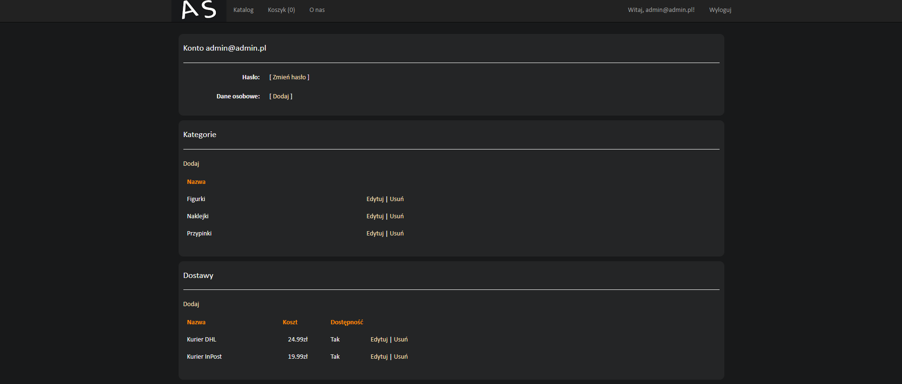

# C# ASP.NET MVC sklep internetowy

created by Szymon Krawczyk

(Kliknij w obrazek by powiększyć)

Katalog

Produkt

Strona informacyjna

Rejestracja

Logowanie

Nowy profil

Dodawanie danych

Profil z danymi

Koszyk

Składanie zamówienia

Zamówienie widoczne w profilu (i jego status)

(Rozwinięcie by zobaczyć szczegóły)

Panel konta administratora

(szczegóły nowego zamówienia)

Po potwierdzenie wysłania zamówienia, zmienia się jego status i jest to widoczne dla użytkownika

